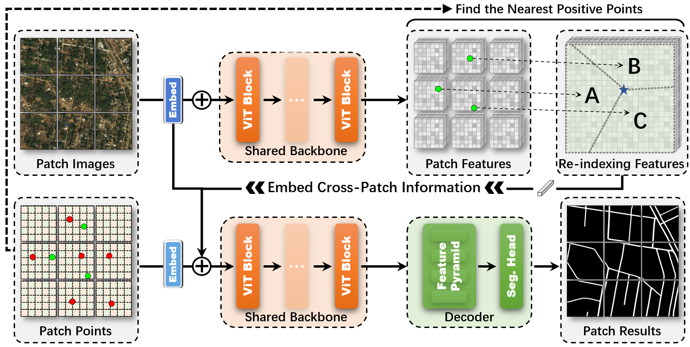

CrossCut
This is the official implementation for our AAAI 2026 Oral paper: "CrossCut: Cross-Patch Aware Interactive Segmentation for Remote Sensing Images".

Note: The paper and citation details will be released shortly. Please stay tuned!

# 📢 News
[2025-12]: The official code and pre-trained models are released!

[2025-11]: CrossCut is accepted by AAAI 2026 (Oral)!

# 🏠 Introduction
CrossCut is a novel interactive segmentation framework designed for remote sensing imagery. It introduces a cross-patch aware mechanism to handle remote image segmentation effectively.

  

# 🛠️ Environment Setup

    ## Clone the repository
    git clone https://github.com/nanzhou02/CrossCut.git
    cd CrossCut

    ## Create a conda environment
    conda create -n crosscut python=3.8.8
    conda activate crosscut

    ## Install dependencies
    pip install -r requirements.txt

# 🚀 Usage
    Before training and evaluation, please download the datasets and models, and then configure the path in config.yml.

    1. Training

        We the ViT-B [SimpleClick](https://github.com/uncbiag/SimpleClick) model trained on COCO+LVIS datasets as our base model. (click to download: [ViT-Base](https://drive.google.com/file/d/10i-7TQh0o_L50S4VanEfZCJ5fpdjGTAo/view?usp=sharing)) 

        To train the model:

        python train.py models/iter_mask/plainvit_base448_crosscut.py \
        --weights=./weights/cocolvis_vit_base.pth \
        --ngpus=4 \
        --batch-size=8 

    2. Evaluation

        To evaluate with pre-trained model:

        python scripts/evaluate_model.py NoBRS --checkpoint=./weights/CrossCut.pth --datasets=iSAID,DeepGlobe,Inria --merge --gpu=0 

## Download 
CrossCut models: [Google Drive](https://drive.google.com/file/d/1zuyhtWhgir4HmXIJgk4i-8XWSR1ByVe2/view?usp=sharing)

Inria dataset : [Google Drive](https://drive.google.com/file/d/1h_b2jIMpmIM0uO_jdSiBe14ofalW92wM/view?usp=sharing) 

DeepGlobe dataset : [Google Drive](https://drive.google.com/file/d/1U-4sTGeEQ8RN_Gqp-EiaU7i77I6mUVf7/view?usp=sharing)

iSAID dataset : [official site](https://captain-whu.github.io/iSAID/)

## License
The code is released under the MIT License. It is a short, permissive software license. Basically, you can do whatever you want as long as you include the original copyright and license notice in any copy of the software/source. 

## 📝 Citation
The paper is not publicly available yet. We will update the BibTeX and arXiv link here as soon as the camera-ready version is released.

If you use this code in the meantime, please refer to this repository.

## Acknowledgement
Our project is developed based on [RITM](https://github.com/saic-vul/ritm_interactive_segmentation). Thanks for the nice demo GUI :)

## 📧 Contact
For any inquiries, please contact: zhoun1468@gmail.com

